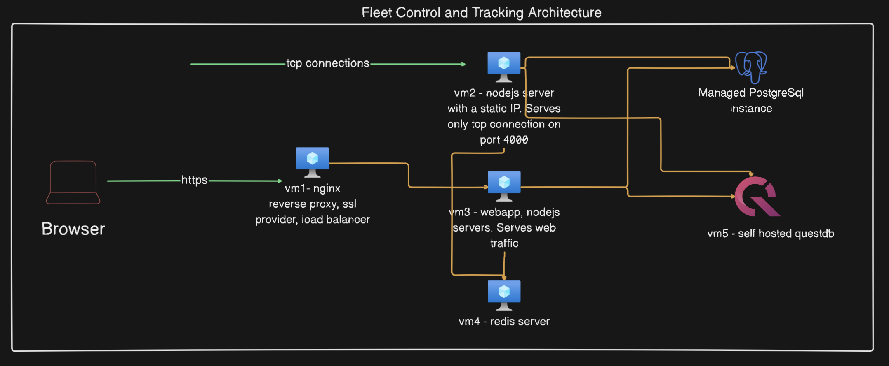

## Introduction
This is a highly scalable production grade, saas ready fleet control reporting and dashboard backend component. This can be used along with the frontend component [(github link)](https://github.com/oldcrux/fleetcontrol_app) for a full application experience.

This application can be connected to a fleet of vehicles telematics device via tcp connection and can receive data as frequently as 10 sec.  There is a rate limiter implemented and configurable via an application parameter, in case you want to turn on/off or manage the frequency of tcp data inflow.

## Architecture diagram
👉🏻 [Architecture diagram]



👉🏻 For detailed load testing and resource utilization, see the [Performance Report](docs/Performance.md).

### Tech Stack
1. Nodejs
2. Postgesql
3. Questdb
4. Grafana
5. Redis
6. Bullmq
7. Sequelizedb orm
8. File based logging + winston cloud logging
9. nodemailer for report emailing

## Functional Features
1. Organization onboarding and management.
2. User onboarding. New user can be created by an administrator. Supported authentication methods - 
    1. Basic username and password.
    2. Google OAuth.

3. Vendor onboarding. A vendor can be a contractor with a fleet of vehicles. A fleet can belong to a main organization or a vendor.
4. Vehicle onboarding and tracking.
5. Create geofences and assign a group of geofences to a vehicle.
6. Generate on-demand vehicle telemetry reports for the day with data like, total running time, total idle duration, geofences covered, time spent any assigned geofence location etc.
7. Geofence accuracy - This is a configurable number by which geohashing precision is calculated and determined whether a vehicle has traveled to an assigned geofence location. This can be configured at each Org level and defaulted to 30 meters.
8. Vehicle arrival window - A configurable time window, lets say 15mins to determine whether a vehicle has arrived an assigned location or not.
7. Email reports in xls format.

Note - this application is tested with a iTriangleTS101 telematics device.  For other devices, separate parsers can be written.

## Technical Features
1. Uses questdb for device telemetry data storage and postgresql for long persistent data.
2. Heavily uses redis cache to reduce db communication.
3. Accurately calculates vehicle's running and idle duration. (Note - Idle=Engine is turned on and vehicle is not moving). Thus solving the gap and island issue.
4. Configurable tcp data rate limiter.
5. Separate configurable tcp data rate limiter when vehicle is off.
6. Bullmq is used to execute long running jobs like report generation and tcp data processing.
7. A grafana dashboard is available for historical data analysis of vehicles.

### Authentication
The application has a basic auth setup and the APIs are protected behind a middleware, which validates the auth token, before letting API access.

#### Google OAuth Setup Guide

To enable Google OAuth in your application, follow the steps below:

- 📄 [Google OAuth Documentation](https://developers.google.com/identity/protocols/oauth2)  
  Review the official Google documentation for understanding OAuth 2.0 implementation.

- ⚙️ [Google OAuth Configuration](https://console.developers.google.com/apis/credentials)  
  Visit the Google Developer Console to create and manage your OAuth client credentials.

This setup should be done on the frontend application, and the same ```GOOGLE_CLIENT_ID, GOOGLE_CLIENT_SECRET``` must be maintained here.

### Prerequisite
1. Docker demon
2. Node
3. npm

### Application setup

Note- if you need to enabling realtime vehicle tracking update, [`GeofenceController.updateGeofenceLocationTouchFlag()`](./src/controller/GeofenceController.ts#430) , you need to have posgGIS support in postgreSQL. read - https://postgis.net/.

A docker version of postgreSQL doesnot come with this plugin, so for local testing you need a local postgresql installation.

This application contains a docker-compose.yml file, that contains images for postgresqldb, questdb, grafana and redis.

At the root directory, run 
```
docker compose up -d
```
On the first run, it will download the images and bring up the containers. To shutdown, run
```
docker compose down
```


### .env file template
```
export NODE_ENV=development/production

# Postgresql connection details
export PG_HOST=
export PG_PORT=
export PG_DATABASE=
export PG_USER=
export PG_PASSWORD=
export PG_DIALECT=postgres

# Questdb connection details
export QUEST_DB_HOST=
export QUEST_DB_USER=
export QUEST_DB_PASSWORD=
export QUEST_DB_AUTO_FLUSH_ROWS=500
export QUEST_DB_AUTO_FLUSH_INTERVAL=1000

# Redis connection details
export REDIS_HOST=
export REDIS_PORT=
export REDIS_CACHE_GLOBAL_TIMEOUT=3600     #1 hour

# GOOGLE_CLIENT_ID and GOOGLE_CLIENT_SECRET are required for google oauth setup. Follow the documentation given above
export GOOGLE_CLIENT_ID=
export GOOGLE_CLIENT_SECRET=

# This is sample JWT_SECRET value. Make sure to change it for your application. This key must be same across your frontend and backend server app.
export JWT_SECRET=bb9u0srGafGVy5smDOkRZTtD0i74XOS5q45rTkinsRc=

# smtp configurartion for email
export EMAIL_HOST=
export EMAIL_USER=
export EMAIL_PASSWORD=

# Some application configuration parameters. They will eventually be moved to database for better maintainability.
export SSE_DATA_PUSH_INTERVAL=10000   # 10 Secs
export POINT_WITHIN_RADIUS_ACCURACY_IN_METERS=30
export QUESTDB_GEOHASH_PRECISION=30
export GEOFENCE_SCHEDULE_ARRIVAL_WINDOW=30 # in minutes.  Because of the between operator in the query, this value will be sliced /2 while using.


```

### Run the application
Execute below command to start the application in local - 

```
npm install
npm run dev
```

###### Docker Build and Push
```
npm run build
docker build --no-cache --platform linux/amd64 -t <your repo> .
docker push <your repo>
```